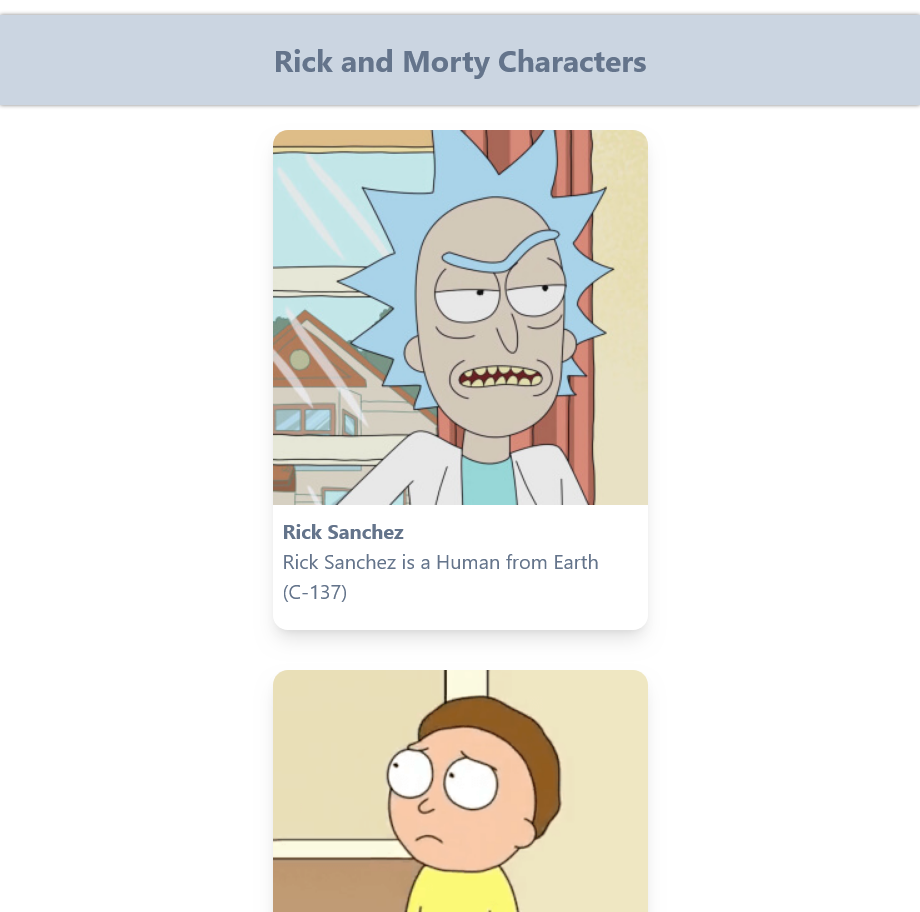

# Rick and Morty characters

* In this web application, fetching data from an external API using React.js
* Managing the state using Redux.
* Displaying the fetched data on the main page in the form of cards with character images, names, species and origin.
* Pagination logics developed.
* Responsive web design.

## Screenshots

### Xtra Large screen view

### Small screen view

